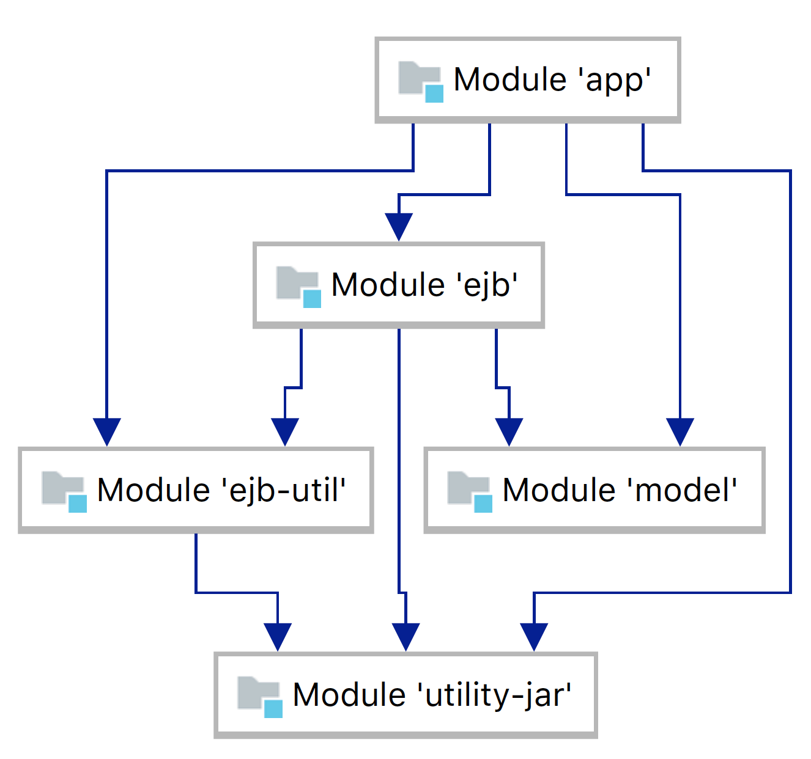

A JavaEE application that uses
 - Servlet
 - EJB
 - CDI
 - JPA
 - Hibernate
 - Angular
 - AngularJS

The maven module structure is as follows
 |_ utility-jar : Jar module that has utility classes
 |_ web-app : A pom module for the web application
      |_ app : All web content including both server side and client side code
      |_ ejb : Module that contains EJB
      |_ ejb-util : utility module for EJBs
      |_ model : Persistence code

Maven dependency diagram :

